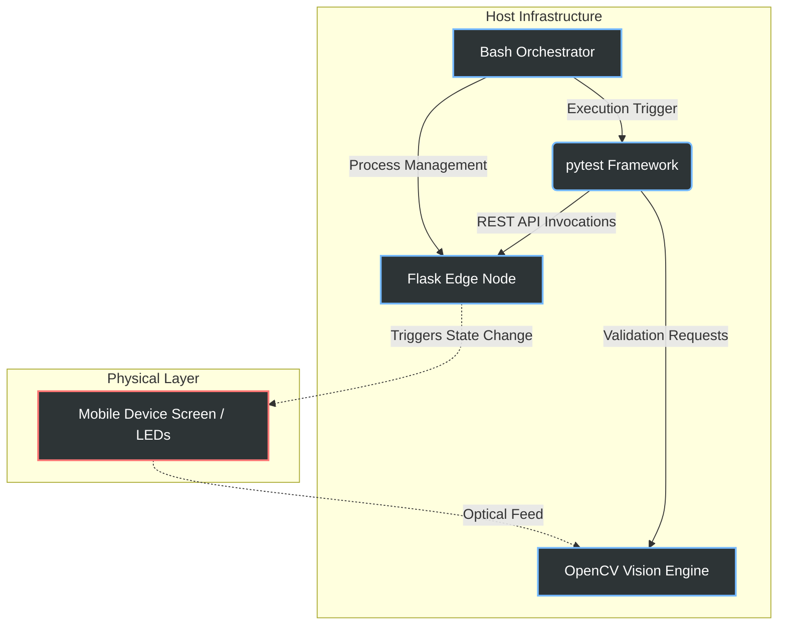

# VisionHIL

## I. Project Overview
**VisionHIL** is an automated Hardware-in-the-Loop (HIL) testing framework.
- **Core Function**: Utilizes Computer Vision to physically validate the operational state of an edge node.
- **Primary Goal**: Bridges the diagnostic gap between software-level execution logs and physical hardware reality.

## II. Project Significance
Traditional testing environments frequently rely on software-level response codes, which creates a critical vulnerability:

- **The "False Positive" Problem**: Software components report a successful execution state, but the underlying physical hardware (e.g., status LEDs or external displays) fails to actuate due to driver anomalies or hardware malfunctions.
- **The VisionHIL Solution**: Enforces direct optical validation of the hardware output. It rigorously ensures that the physical hardware behaves exactly as the intended software state dictates.

## III. System Architecture
The system infrastructure integrates four primary subsystems operating in continuous synchronization:



| Subsystem | Technology | Technical Description |
|-----------|------------|-----------------------|
| **Orchestration** | Bash | A determinative control script (`run_tests.sh`) responsible for managing background process lifecycles, execution flow, and health-check polling via `curl`. |
| **Edge Node** | Flask | A local HTTP server simulating a 5G edge node, binding to local network interfaces (`0.0.0.0`) to facilitate real-time interactions with physical test devices. |
| **Vision Engine** | OpenCV | Executes deterministic hardware state validation utilizing HSV color-space masking. It employs morphological operations (dilation) to reject ambient noise and manage occlusions. |
| **Test Suite** | pytest | An automated validation framework executing REST API mutations against the edge node and coordinating synchronized optical assertions. |

## IV. Setup Instructions

### 1. Dependency Initialization
Provision the Python environment by installing the requisite dependencies. Executing via `python -m pip` ensures packages are strictly localized to the active interpreter.

- Run the following command in your terminal:
  ```bash
  python -m pip install -r requirements.txt
  ```

### 2. Network Configuration
The Edge Node server operates on port `5000`. 
- **Requirement**: The physical test client (e.g., a mobile device) must reside on the same local network subnet as the host machine.
- **Access**: Interface with the application by navigating to the host machine's designated IPv4 address (e.g., `http://<host-ip>:5000`).

## V. AI Integration
Artificial Intelligence systems were utilized in the development of this repository to inform critical architectural and computational specifications:

- **Computer Vision Optimization**: 
  - Analyzed camera inputs to inform parameter tuning.
  - Computationally optimized HSV threshold boundaries against variable environmental lighting conditions.
- **Process Management**: 
  - Designed the infrastructure governing Linux process lifecycle management.
  - Implemented robust teardown routines using `trap` signals to actively mitigate dangling ports and zombie processes.
