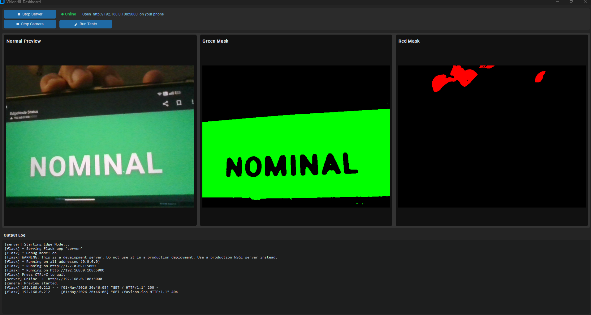
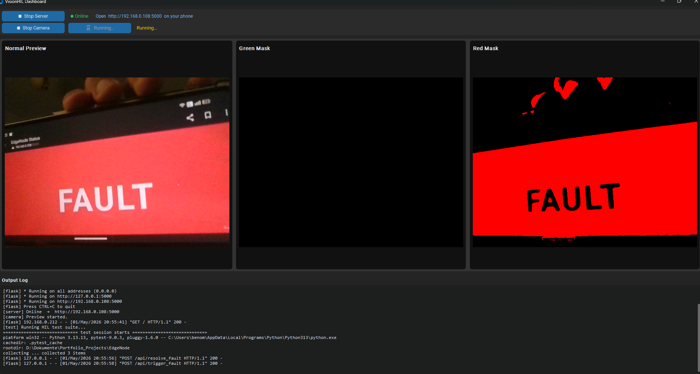
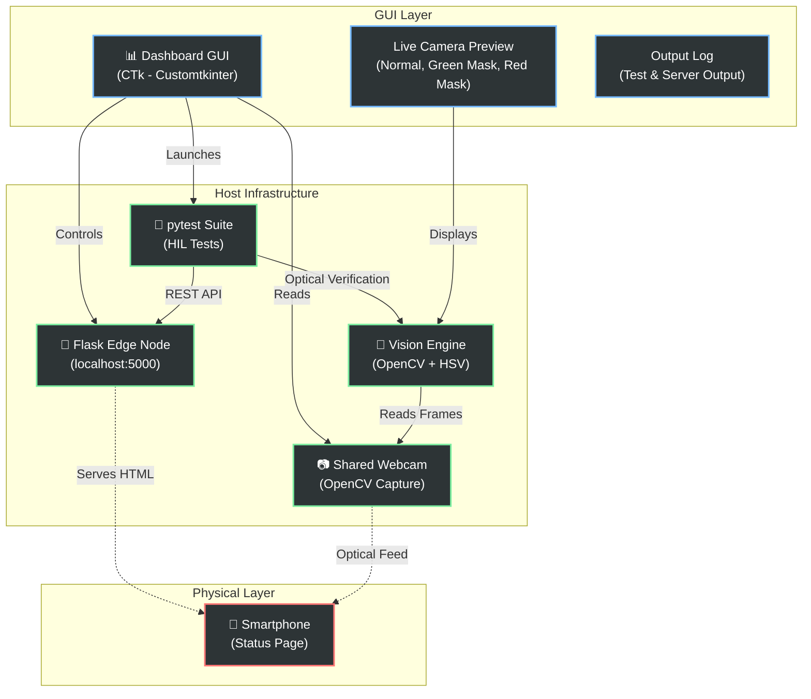

# VisionHIL – Hardware-in-the-Loop Testing with Computer Vision

**TL;DR**: A GUI-driven testing framework that verifies an edge node's operational state by pointing a webcam at a smartphone display, triggering test scenarios via REST API, and using OpenCV to optically validate that the screen changes color (green = operational, red = fault) in real-time. No false positives — only hardware validation.

### Visual Examples

<div style="display: flex; gap: 20px; justify-content: center;">
  <div>
    <h4 style="text-align: center;">NOMINAL State (Green)</h4>
    
  </div>
  <div>
    <h4 style="text-align: center;">FAULT State (Red)</h4>
    
  </div>
</div>

---

## Quick Start

1. **Install dependencies:**
   ```bash
   python -m pip install -r requirements.txt
   ```

2. **Launch the dashboard:**
   ```bash
   python src/dashboard.py
   ```

3. **Point a webcam at your smartphone** (running the served status page), then:
   - Click **"▶ Start Server"** to boot the Flask edge node simulator
   - Click **"📷 Camera Preview"** to see live camera feeds with color masks
   - Click **"🧪 Run Tests"** to trigger automated HIL tests
   - **Watch the camera preview update live** as tests run and the smartphone screen changes color

---

## I. Project Overview

**VisionHIL** is an automated Hardware-in-the-Loop (HIL) testing framework that bridges the gap between software assertions and physical hardware reality.

- **Core Function**: Uses Computer Vision (OpenCV) to optically validate the operational state of an edge node by analyzing a live camera feed pointed at a smartphone display.
- **Primary Goal**: Eliminate false positives where software claims success but the physical hardware (display, LEDs) fails to respond due to driver anomalies or hardware faults.
- **The VisionHIL Solution**: Every test outcome is backed by direct optical evidence. Software triggers state changes via REST API, and a webcam + OpenCV verify that the physical display actually responds as expected.

## II. Key Features

- **GUI Dashboard** — Single-window control panel for the entire HIL workflow
- **Live Camera Preview** — Three synchronized camera streams showing:
  - **Normal Preview**: Raw camera feed
  - **Green Mask**: Highlights green pixels (NOMINAL state)
  - **Red Mask**: Highlights red pixels (FAULT state)
- **Shared Camera Architecture** — Camera stays active during tests, so you see real-time verification happen
- **Flask Edge Node** — Lightweight HTTP server simulating a 5G edge node with a responsive web interface
- **Automated Test Suite** — pytest-driven integration tests coordinating REST API calls + optical assertions
- **HSV Color Detection** — Robust color detection that handles variable lighting via morphological operations

## III. System Architecture

The system integrates multiple layers working in synchronized harmony:



| Component | Technology | Purpose |
|-----------|------------|---------|
| **Dashboard** | CustomTkinter (CTk) | GUI control panel that manages server lifecycle, camera preview, and test execution from a single window. |
| **Edge Node** | Flask | Lightweight HTTP server simulating a 5G edge node, serving an interactive status page that changes color based on node state (NOMINAL = green, FAULT = red). |
| **Vision Engine** | OpenCV + NumPy | Analyzes webcam frames in real-time using HSV color-space masking and morphological operations to detect color changes on the smartphone display. |
| **Test Suite** | pytest | Automated integration tests that trigger REST API mutations (fault injection, fault resolution) and coordinate synchronized optical assertions via the vision engine. |
| **Shared Camera** | OpenCV VideoCapture | Single thread-safe camera handle shared between the dashboard preview and test suite, ensuring continuous live view during test execution. |

## IV. Setup & Execution

### Installation

1. **Install dependencies:**
   ```bash
   python -m pip install -r requirements.txt
   ```

2. **Network Configuration**: The Edge Node server operates on port `5000`. The physical test client (e.g., a mobile device) must reside on the same local network as the host machine. Access the status page by navigating to `http://<host-ip>:5000` on your phone.

### Execution Modes

#### **Primary: GUI Dashboard** (Recommended)
Launch the interactive control panel to manage the entire HIL workflow — server startup, live camera preview with detection overlays, and test execution:

```bash
python src/dashboard.py
```

**Features:**
- Manage Flask server lifecycle
- View live camera feed with real-time color mask detection
- Trigger automated tests and observe verification in real-time
- Scroll through consolidated output log (server, tests, camera diagnostics)

#### **Alternative: Bash CLI** (Headless / CI)
For automated CI/CD pipelines or server environments without a display:

```bash
./run_tests.sh
```

#### **Utilities: Debug & Standalone Tools**

Inspect the raw webcam feed and HSV colour masks independently (useful for tuning detection thresholds):

```bash
python src/debug_cv.py
```

## V. How It Works

1. **Start the Edge Node** — Click "▶ Start Server" in the dashboard. Flask boots on `localhost:5000` and serves an interactive status page (green = NOMINAL, red = FAULT).

2. **Open Status Page on Phone** — Navigate to `http://<host-ip>:5000` on your smartphone. You'll see a large colored background and state text.

3. **Start Camera Preview** — Click "📷 Camera Preview" to activate the webcam. The three panels show:
   - **Normal Preview**: Raw camera feed (your hand, phone, environment)
   - **Green Mask**: Highlights green pixels detected on the phone screen
   - **Red Mask**: Highlights red pixels detected on the phone screen

4. **Run Tests** — Click "🧪 Run Tests". The test suite:
   - Sends REST API commands to trigger faults or resolve them
   - Waits for the smartphone display to respond (screen color changes)
   - Uses OpenCV's HSV color detection to verify the optical outcome
   - Reports pass/fail based on whether the physical display matched expectations
   - **Camera preview stays active throughout** so you see validation happen in real-time

5. **Verify Results** — Check the Output Log for test results. All state changes are optically verified.

## VI. Color Detection & HSV Masking

The vision engine uses OpenCV's HSV color-space conversion to detect specific colors on the smartphone display:

- **Green Detection** (`_GREEN_LOWER` to `_GREEN_UPPER`): Identifies the NOMINAL state
- **Red Detection** (two ranges: wraps around hue axis): Identifies the FAULT state
- **Morphological Operations**: Dilates the masks to close small gaps and reject noise
- **Density Threshold** (`min_ratio=0.05`): Requires at least 5% of pixels to match the target color

### Tuning Detection Parameters

Edit the HSV bounds in `src/cv_validator.py` if detection is unreliable:

```python
_RED_LOWER_1 = np.array([0, 80, 100])
_RED_UPPER_1 = np.array([15, 255, 255])
_RED_LOWER_2 = np.array([165, 80, 100])
_RED_UPPER_2 = np.array([180, 255, 255])
_GREEN_LOWER = np.array([35, 60, 60])
_GREEN_UPPER = np.array([90, 255, 255])
```

Run `python src/debug_cv.py` to see the masks in real-time and experiment with threshold values.

## VII. Project Structure

```
EdgeNode/
├── src/
│   ├── __init__.py              # Package marker
│   ├── dashboard.py             # CTk GUI control panel (main entry point)
│   ├── server.py                # Flask edge node simulator
│   ├── cv_validator.py          # OpenCV vision engine & color detection
│   ├── debug_cv.py              # Standalone debug tool for camera tuning
│   └── test_ratio.py            # Utility for analyzing color density
├── tests/
│   ├── conftest.py              # pytest fixtures & cleanup
│   └── test_hil_execution.py    # Integration tests (fault trigger, resolution, optical verification)
├── requirements.txt             # Python dependencies
├── run_tests.sh                 # Bash orchestration script (CI fallback)
└── README.md                    # This file
```

## VIII. Development Notes

### Camera Sharing Architecture
The dashboard and test suite share a single `VideoCapture` instance via thread-safe access in `cv_validator.py`. This allows:
- **Live preview during tests** — Camera remains open and streaming frames to the GUI while pytest runs
- **No device contention** — Thread lock ensures only one process reads frames at a time
- **Efficient resource usage** — Single webcam handle instead of fighting over device access

### Environment Variables
- `VISION_DEBUG=1` — Enables shared camera mode (used by pytest for live debugging)
- `VISION_DEBUG_SHOW_WINDOWS=1` — (Optional) Shows OpenCV preview windows during test execution

## IX. AI Integration & Development

Artificial Intelligence systems were utilized in the development of this repository to inform critical architectural and computational specifications:

- **Computer Vision Optimization**: 
  - Analyzed camera inputs to inform HSV threshold tuning.
  - Optimized color detection parameters against variable environmental lighting.
- **Architecture Design**: 
  - Informed the design of shared camera access and thread synchronization.
  - Optimized the GUI layout and real-time update cadence.

---

**Questions?** Review the source code in `src/` or run the debug tools to inspect behavior directly.
