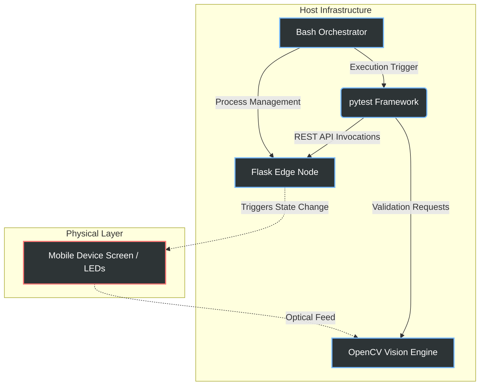

# VisionHIL

## I. Project Overview
VisionHIL constitutes an automated Hardware-in-the-Loop (HIL) testing framework leveraging Computer Vision to physically validate the operational state of an edge node. This infrastructure bridges the diagnostic gap between software-level execution logs and physical hardware reality.

## II. Project Significance
In traditional testing environments, validation assertions frequently rely on software-level response codes. This methodology is inherently vulnerable to the "False Positive" paradigm, wherein software components report a successful execution state while the underlying physical hardware (e.g., status LEDs or external displays) fails to actuate due to driver anomalies or hardware malfunctions. VisionHIL resolves this critical discrepancy by enforcing direct optical validation of the hardware output, rigorously ensuring physical coherence with the intended software state.

## III. System Architecture

The system infrastructure integrates four primary subsystems operating in continuous synchronization:



| Subsystem | Technology | Technical Description |
|-----------|------------|-----------------------|
| **Orchestration** | Bash | A determinative control script (`run_tests.sh`) responsible for managing background process lifecycles, execution flow, and health-check polling via `curl`. |
| **Edge Node** | Flask | A local HTTP server simulating a 5G edge node, binding to local network interfaces (`0.0.0.0`) to facilitate real-time interactions with physical mobile test devices. |
| **Vision Engine** | OpenCV | Executes deterministic hardware state validation utilizing HSV color-space masking. It employs morphological operations (dilation) to reject ambient noise and manage occlusions such as foreground text. |
| **Test Suite** | pytest | An automated validation framework executing REST API mutations against the edge node and coordinating synchronized optical assertions. |

## IV. Setup Instructions

### Dependency Initialization
Provision the Python environment by installing the requisite dependencies. Executing via `python -m pip` ensures packages are strictly localized to the active interpreter:

```bash
python -m pip install -r requirements.txt
```

### Network Configuration
The Edge Node server operates on port `5000`. To interface with the simulated node from a physical test client (e.g., a mobile device), ensure the client resides on the corresponding local network subnet. Access the application interface by navigating to the host machine's designated IPv4 address (e.g., `http://<host-ip>:5000`).

## V. AI Integration
Artificial Intelligence systems were utilized in the development of this repository to inform critical architectural and computational specifications:
- **Computer Vision Optimization**: Algorithmic models were leveraged to analyze camera inputs and computationally optimize the HSV threshold boundaries against variable environmental lighting conditions.
- **Process Management**: The infrastructure governing Linux process lifecycle management—specifically the implementation of robust teardown routines using `trap` signals to mitigate dangling ports and zombie processes—was architected via AI consultation.
